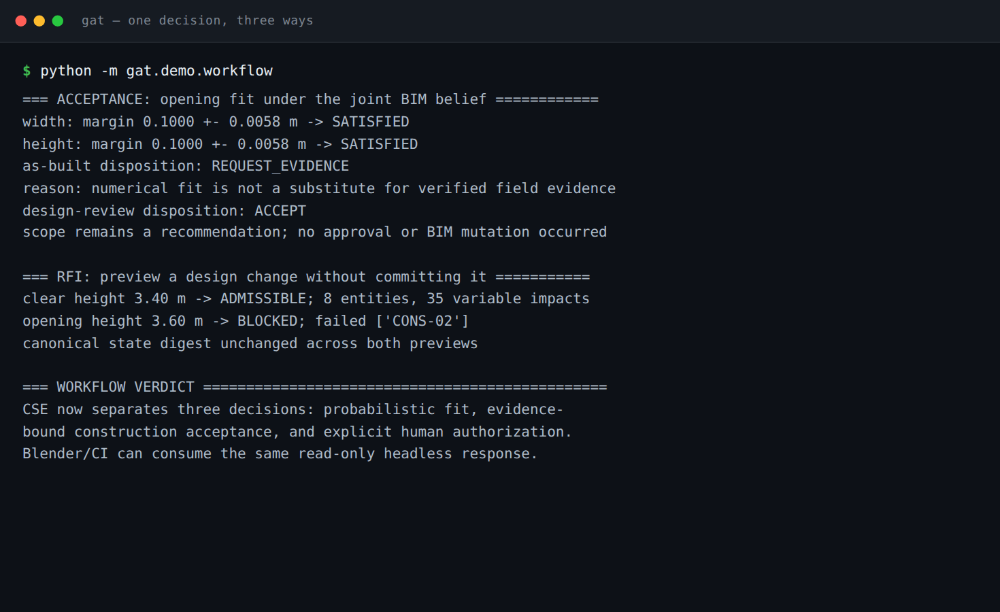
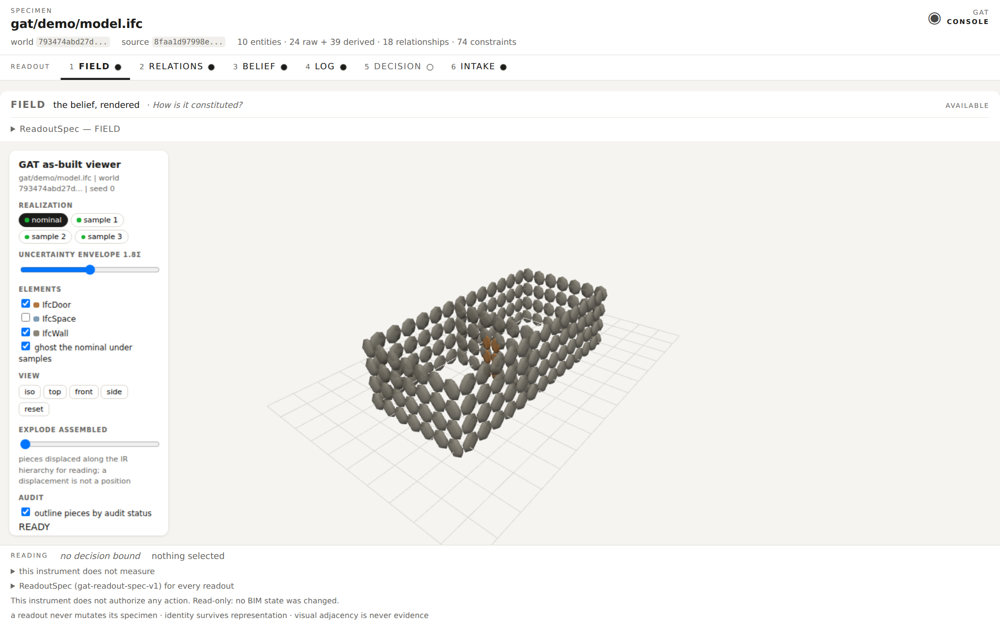
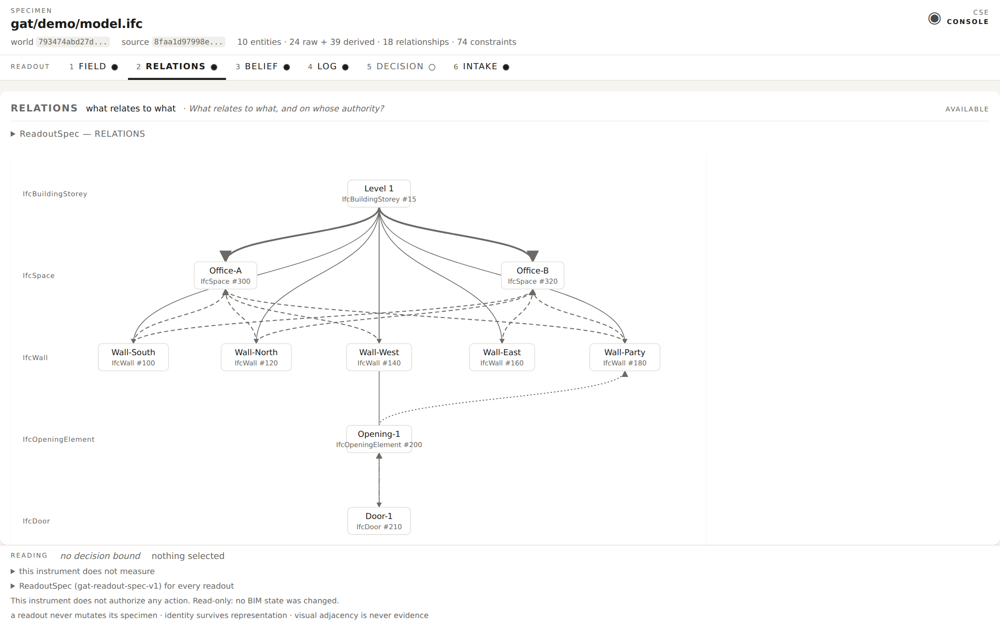
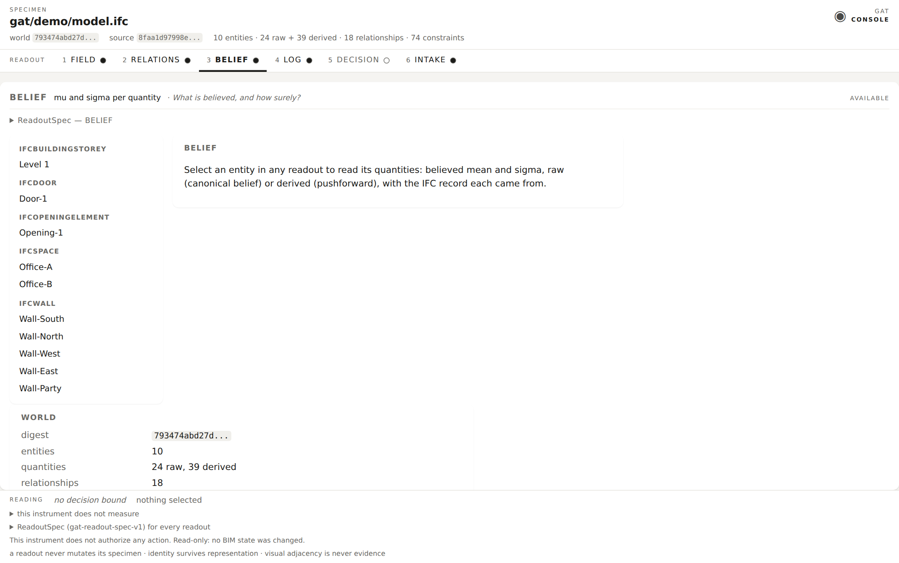

# Construction State Estimator for BIM (WIP).

Portable **evidence-to-decision** runtime for BIM. CSE compiles IFC design
intent into an auditable architectural belief, conditions that belief on
physical evidence, and returns a fail-closed disposition:

```text
intent + evidence + criterion
    → posterior belief
    → SATISFIED / VIOLATED / UNRESOLVED
    → ACCEPT / REJECT / REQUEST_EVIDENCE
    → verified state (replayable)
```

It is **not** a learned neural Transformer, a Revit replacement, an FEM
solver, or a digital-twin platform. “Transformer” means a verified state
transform. OpenUSD is an optional signed restart carrier.

Status: experimental v0. License: MIT. Core dependency: `numpy`.

The long-form architecture, research questions, and historical README live in
[`docs/treatise.md`](docs/treatise.md).

## Loop

```text
IFC design intent + physical evidence
    → posterior architectural belief
    → SATISFIED / VIOLATED / UNRESOLVED
    → stop, or select the next worthwhile measurement
    → condition → propagate → verify → export
```

First deployment slice: construction acceptance (as-built clearance,
prefabrication / opening fit, design-change impact). A case is never accepted
because the BIM prior looks safe. Every satisfied check needs calibrated
evidence bound to the same world, and enough **geometry authority** to justify
the check.

## Install

```bash
pip install numpy
pip install -e .
python -m unittest discover
```

Python 3.11+. Optional extras: `openusd` (Pixar OpenUSD carrier +
signatures), `ifcopenshell` (second IFC inventory adapter; not the
authoritative loader).

## Start here

Every `gat` command is read-only. Nothing in this repository mutates a BIM.

```bash
gat audit gat/demo/beam_model.ifc --text      # what can this file become?
gat inspect gat/demo/model.ifc --var "Level 1.TotalWallCost"
```


`audit` answers the only question worth asking first — *can CSE open this
model at all* — without partially importing it. `inspect` shows the second
idea, and the two lists under it disagree on purpose. `ClearHeight` has a
large **sensitivity** (+2873.6 per metre, fifth of six) and contributes 0.7%
of the **variance**, because it is believed to ±10 mm. Two walls' `UnitCost`
carry 77.5% of it between them. What moves the answer most is not what you
are least sure of, and a design tool that only shows you the first one is
pointing at the wrong thing.

## One decision, three answers

```bash
python -m gat.demo.workflow
```



The same geometric fact — a door 100 mm narrower than its opening — produces
three different answers depending on who is asking:

- **as-built policy → `REQUEST_EVIDENCE`.** A numerical fit is not field
  evidence. Nothing was measured, so nothing is accepted.
- **explicit design-review policy → `ACCEPT`.** A recommendation, not an
  approval, and it says so.
- **RFI preview → mutates nothing.** The world digest is unchanged across
  both previews.

Separating those three is the product.

## Three ways to not pass

```bash
gat verify state.usda        # a world restored from its carrier
```


`verify` is clean only when a rule applied *and* it held. The three
outcomes are the whole fail-closed stance in one command:

- **SATISFIED** — eight rules applied, all above the pass bar.
- **UNRESOLVED** — no compliance rule reached that world. Nothing was
  established, and "nothing was checked" is not "nothing is wrong". A
  `MARGINAL` margin lands here too: at `P = 0.5040` a clearance is a coin
  toss, not a pass.
- **refused** — the carrier is a text file and someone raised a storey in
  it. A stage commits to a module digest, a bytewise world digest, and a
  configuration digest; the loader recomputes all three and names the one
  that broke.

Exit codes follow: `0` clean, `1` a finding, `2` input CSE will not accept.

## The instrument and its surfaces

Offline, self-contained HTML. No server, no network, no telemetry — each is a
single file you can email to an engineer. They come in two classes, and the
difference is enforced, not stylistic:

- **Reports** (`gat report`, `gat ledger`, `gat audit --html`) carry no
  scripts and fetch nothing. Interactivity is native `<details>` only, so a
  report attached to an RFI or pulled out of an archive cannot change meaning.
- **Instruments** (`gat console`, `gat view`) carry their own inline scripts
  under the same isolation — one file, no network, no external resource — and
  render state without ever mutating it.

`gat console` is the instrument that holds the others against one specimen.

### `gat console` — one specimen, six readouts

```bash
gat console gat/demo/model.ifc -o console.html --variations 3 --ledger ledger.json
```



Laid out the way instruments are: the **specimen** and its identity at the
top, where you can always see what is loaded; a **function selector** where
every position reads something and an unlit lamp means nothing is bound yet;
and a **reading** at the bottom. FIELD renders the belief itself — each
element is a Gaussian, and the sample selector redraws the building under a
different realization of the same posterior. The uncertainty envelope slider
is in sigmas, not pixels.



RELATIONS shows the typed IFC relationship graph the belief is coupled
through — and states plainly that *position and distance on this canvas are
not evidence*. Every readout carries that discipline.



BELIEF is `N(mu, Sigma)` per entity: every quantity's mean and sigma, raw or
derived, with the IFC record it came from.

The footer carries what the instrument **does not** measure — geographic
position, geodetic reality, time — as a standing declaration. An earlier
shell carried two of those as permanently unavailable modes on the selector;
a knob that never turns teaches an operator to distrust the ones that do.
See [`docs/readout-spec-v1.md`](docs/readout-spec-v1.md).

### `gat report` — a decision, and why

```bash
gat-headless request.json -o response.json
gat report response.json --html -o report.html
```


A design belief said the beam was `SATISFIED` at P = 0.963. A measured
material certificate revised its yield strength from 350 ± 8 to 326.5 ± 1.9
MPa, and the same AISC 360-22 F2-1 computation moved design capacity from
315.0 ± 7.9 to 293.8 ± 3.4 kN·m — so the verdict became `VIOLATED` at
P = 0.018 against a 301 kN·m demand.

The full report continues into the evidence chain: the certificate's issuer,
batch, specimen, calibration digest, and a row that reads
`may_authorize: no`. CSE will tell you the beam fails. It will not tell you
that it is therefore safe to act.

### `gat ledger` — what actually happened

```bash
gat ledger ledger.json --html -o ledger.html
```


Every transition is hash-chained to the one before it, carries the world
digest on both sides, and records its own verification result. A replay on a
compatible runtime reproduces the chain or refuses it.

### `gat view` — the belief and its samples

```bash
gat view gat/demo/model.ifc -o viewer.html --variations 3
```

The same renderer the console embeds as FIELD, standalone, with an optional
`--decision` overlaid on the geometry it was taken about. The scene layer
lowers walls, spaces, openings and doors; a world without them — a lone beam,
say — is refused with a message that names what is missing rather than a
numerical error.

## Geometry authority

A probabilistic number is not enough to close a case. Every check declares
what support it used, and the policy refuses to authorize on insufficient
support. See [`docs/geometry-authority-v1.md`](docs/geometry-authority-v1.md).

| Code | Closes clearance? | Closes capacity? |
|---|---|---|
| `SWEPT_SOLID` | yes | yes |
| `SCAN_GMM` | yes | yes |
| `QUANTITY_ONLY` | no | yes |
| `DECLARED_CORROBORATED` | no | yes |
| `DECLARED_PROPERTY` | no | no |
| `LENGTH_ONLY` | no | no |
| `GAUSSIAN_PROXY` | no | no |
| `INSUFFICIENT` | no | no |

A declared section modulus is checked against the model's own solid through
the shape factor Z/S before it earns `DECLARED_CORROBORATED` — a bracket, not
an equality, because the adapter derives the *elastic* modulus and the
property set declares the *plastic* one.

## Invariant and variant

Verification distinguishes a constraint that holds from one that merely holds
*at the mean*. `CONS-01` and `CONS-02` report `p_holds`, and the margin's
variance carries the covariance term, so quantities that move together are
not treated as independently uncertain. Below the policy's declared
confidence a constraint is **variant**: it cannot authorize, and it becomes a
ranked request to measure the variable that would settle it.

## Honesty (v0)

- Covariance is first-order. Means of derived quantities are exact re-evaluations.
- Dense `float64` covariance is the verified oracle. Sparse / factor-graph
  belief is planned, not shipped. See [`docs/sparse-belief-v1.md`](docs/sparse-belief-v1.md).
- The v0 IFC adapter reads quantities and placements, not general solids.
  Beams are `SWEPT_SOLID`, `LENGTH_ONLY`, or `BLOCKED` — never a silent bbox.
- Gaussian clash is a proxy; openings are not subtracted. That support is
  `GAUSSIAN_PROXY` and cannot close an as-built clearance case without scan
  evidence (`SCAN_GMM`) or a later solid adapter.
- The scan path (`SCAN_GMM`) is a validated mechanism on synthetic data. No
  real point cloud has been through it end to end. A simulated terrestrial
  survey has — occlusion, range-dependent noise, mixed pixels, clutter, stray
  returns, through a binary PLY — and it registers 0.15 m out while
  `pose_sigma` reports 6 mm, because a station inside a building cannot see
  the outside of its exterior wall. Nothing downstream is fooled: the
  independent-pose check refuses it at m² of 221 against a gate of 16. See
  [`tests/test_surface_capture_chain.py`](tests/test_surface_capture_chain.py).
- A real capture must be reduced before it is registered — see
  [`gat/geometry/scan_filter.py`](gat/geometry/scan_filter.py), where that
  reduction is recorded as evidence rather than performed quietly. Throughput
  is not one number: the pose search is capped at a 600-point probe, so cost
  per point *falls* with capture size — measured 99 points/s at 700 points,
  156 at 1500, 193 at 4000 against this eight-element model. It is linear in
  model size, which is the binding constraint; see `MAX_LIKELIHOOD_BYTES`.
- A scan measurement now has to survive the quantities that qualify it: a
  pose the scan does not determine, a face the returns span without sampling,
  and a face whose scatter is shape rather than noise are each refused by
  name. `min_face_coverage` catches returns clustered at a face's extremes;
  it is not a completeness check, and half a wall measured well still passes.
- A ledger replay proves history on a compatible runtime. An unsigned chain
  does not prove publisher identity.
- A carrier is checked against its own commitment, not trusted. That check
  is byte-exact on the belief, so a runtime whose numeric configuration
  differs from the exporting one is refused rather than reconciled — the
  refusal says which of the two readings it cannot distinguish.
- A replayable transition commitment binds one accepted step and, when present,
  a **bounded fixed-point arithmetic guest**. It does not prove the Gaussian
  update, the observations, or that the building is safe.
- Determinism is same-platform byte identity.
- A world digest identifies the model's bytes, not its path. See
  [`docs/world-identity-v2.md`](docs/world-identity-v2.md); v1 ledgers and
  carriers do not replay on this runtime.
- Scale is unproven at product size. The shipped inventory covers 24, 4 and 1
  raw variables. What *is* measured: coupling, not size, is what makes the
  covariance dense — 0.1% off-diagonal for independent quantities, 44.5% once
  one variable is shared — and incremental propagation, which wins ~2x on a
  local edit, runs 0.38x at 1024 walls when the shared height moves, because
  every derived row is invalidated anyway. That is the design-change workflow.
  See [`validation/coupled-scale-reference-v1.json`](validation/coupled-scale-reference-v1.json).

## Kernel vs satellites

Frozen for v0.2 unless a change alters a disposition, digest, or replay on
the acceptance / beam / RFI slice. See [`docs/kernel-v1.md`](docs/kernel-v1.md).

| Kernel | Satellite |
|---|---|
| IR, Gaussian belief, propagate, verify | Structural attention |
| Typed evidence, decision, acceptance | Splat export, viewer cosmetics |
| Ledger, snapshot, JSON / signed OpenUSD | Blender coloring |
| IFC audit + beam geometry status | SP1 proving service |
| Headless JSON boundary | Learned weights |

## Evidence, not assertion

Everything in `validation/` is produced by `validation/records.py` and checked
by `tests/test_validation_records.py`. Records are not edited by hand:

```bash
python validation/regenerate.py --check    # what CI runs
```

A changed digest in that diff means a changed decision.

The screenshots above are output too: every one is rebuilt from the running
tool by [`docs/regenerate_images.py`](docs/regenerate_images.py), never
edited. That is not free — regenerating them after the console redesign is
what revealed that one image had been silently capturing the wrong readout —
but a screenshot nobody can reproduce is an illustration, not evidence.

## Docs

- [`docs/treatise.md`](docs/treatise.md) — architecture treatise
- [`docs/geometry-authority-v1.md`](docs/geometry-authority-v1.md)
- [`docs/design-language-v1.md`](docs/design-language-v1.md) — reports vs instruments, and the shared palette
- [`docs/readout-spec-v1.md`](docs/readout-spec-v1.md) — the console's six readouts and what it declares it cannot measure
- [`docs/world-identity-v2.md`](docs/world-identity-v2.md) — path-independent world digests
- [`docs/kernel-v1.md`](docs/kernel-v1.md)
- [`docs/sparse-belief-v1.md`](docs/sparse-belief-v1.md)
- [`docs/ifcopenshell-adapter-v0.md`](docs/ifcopenshell-adapter-v0.md)
- [`docs/proof-carrying-state-v1.md`](docs/proof-carrying-state-v1.md) — replayable transition commitment
- [`docs/workflow-deployment-v1.md`](docs/workflow-deployment-v1.md)
- [`docs/real-ifc-validation-v1.md`](docs/real-ifc-validation-v1.md)

## What This CSE is not

Not Revit, Archicad, CAD, a renderer, an LLM, a generic Gaussian package,
FEM, IFC, or a twin platform. It is a computational layer that can sit
between those representations and a decision.

Not a geospatial or mapping platform either. No coordinate reference system,
geodetic datum or survey epoch is lowered into the IR, so nothing here can be
placed on a map without inventing a position — and an invented position is
visual adjacency presented as evidence. The console declares that limit
rather than reserving a map view for it.

Repository: [giasonpooni/Gaussian-Architectural-Transformer-for-BIM](https://github.com/giasonpooni/Gaussian-Architectural-Transformer-for-BIM).
Engine name is CSE; package is `gat-bim` and the Python namespace is `gat`.
The repository has been `BIM-State-Transformer-Engine-WIP` and
`Gaussian-Architectural-Transformer-for-BIM`; GitHub keeps redirects from
each, so rename it again for CSE when you are ready.
