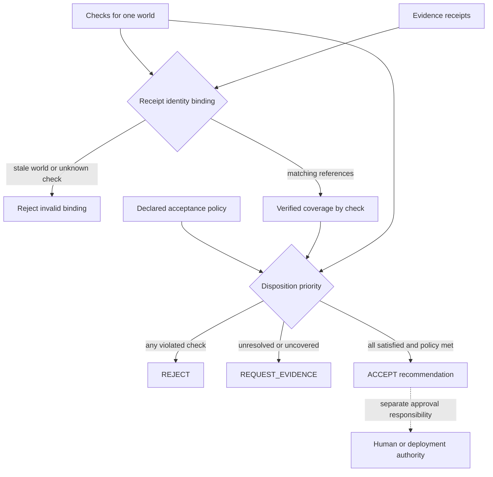

# State Estimator for BIM in the Notation Systems stack

Notation Systems develops computational instrumentation and evidence infrastructure for industrial and cyber-physical systems.
This component owns **BIM evidence-to-decision computation**.
[Notations Engineering Terminal (NET)](https://github.com/giasonpooni/Notations-Engineering-Terminal)
is the programmable scientific controller when this instrument participates
in a composed investigation. The existing NET Python package and session remain
`ciw`; CSE does not become a second controller or move its kernel into NET.
The [stack map](https://github.com/giasonpooni/Notations-Engineering-Terminal/blob/main/docs/STACK.md)
locates components and distinguishes implemented paths from specifications.

## Relationship to NET

The [controller architecture decision](https://github.com/giasonpooni/Notations-Engineering-Terminal/blob/1f5d2e6a1e58ca40074598f889b53e149e03d83e/docs/NET_CONTROLLER_BOUNDARY.md)
is an architecture/interface specification, not proof of an implemented
end-to-end integration. This link pins the review revision.

| NET owns | This repository owns |
| --- | --- |
| Investigation/session context, typed composition, operation selection and dispatch. | Supported IFC interpretation, world/model identity, evidence conditioning and Gaussian belief. |
| Cross-project execution/result dependencies, comparison, inspection and explicit replay requests. | Geometry authority, domain criteria, covariance/diagnostics, disposition semantics and native ledger/replay behavior. |
| References to exactly bound inputs, outputs, source revisions and runtimes. | The mathematical meaning and eligibility of the requested BIM operation. |

NET knows that an estimation occurred; CSE defines what that BIM estimation
means. Integration must use the existing headless/domain boundary and explicit
pinned adapters rather than copying IFC or belief implementations. A runtime
manifest or repository link does not by itself register an executable provider.

The intended output handoff retains posterior/world identity, covariance or
its explicit availability status, diagnostics, disposition, policy and ledger
references where supplied by the operation. Unsupported fields are not
fabricated. NET cannot turn `REQUEST_EVIDENCE` into `ACCEPT`, and `ACCEPT`
remains a scoped recommendation rather than construction approval. ESM's
separate evidence/state admission and release authority is not transferred to
NET or CSE.

A later BIM -> CSR -> GSC investigation needs an explicit supported geometry
handoff. The documented v0 IFC adapter reads quantities and placements, not
general solids; an entity-linked fixture or mapping digest does not establish
an IFC-derived parametric surface or registered scan. Preserve geometry
producer, units, frames, world bindings and registration evidence. Unsupported
surface extraction or covariance conversion remains unsupported.

This documentation change adds no headless action, NET provider, parser,
geometry adapter or new numerical operation. Standalone/offline use remains
supported within the repository's existing scope. `gat-bim`, `gat`, CSE engine
identities, records and historical pins are unchanged.

## Current boundary

| Property | Scope |
| --- | --- |
| Implementation | Executable experimental BIM runtime |
| Workbench connection | Standalone; companion commitment and numerical adapters; composed NET paths require explicit integration qualification. |
| Inputs | IFC design intent, typed observations, declared uncertainty and decision criteria. |
| Outputs | Conditioned architectural state, dispositions, replay records and optional exports. |

BIM priors and synthetic fixtures do not establish as-built acceptance. The bounded arithmetic guest does not prove the observations or general building safety.

## Evidence coverage and disposition

Solid arrows summarize the implemented case evaluator in
`gat/workflows/acceptance.py`; the dotted relationship marks authority outside
that evaluator. Receipt eligibility requires the policy’s accepted evidence kind
and verification flag. A stale receipt is an input error, not missing coverage.
The explicit design-review policy can waive as-built evidence; the disposition
retains that policy choice rather than presenting it as verified construction.

See the [diagram atlas](https://github.com/giasonpooni/Notations-Engineering-Terminal/blob/main/docs/DIAGRAMS.md) for the wider system.

## Interoperability

Integrations use the component's documented contract and an explicit adapter. They preserve source observations, ordered quantities, units, coordinate/frame meaning, time semantics, missingness and declared uncertainty where applicable. An unimplemented field or conversion must be reported as unsupported rather than silently inferred.

Evidence identity names the source record; operation identity names the versioned computation; execution identity names an invocation; result identity names its output; verification identity names a scoped check. These are integration requirements, not a claim that every standalone repository already implements all five record types.

Display names and repository locations do not rename packages, schemas, operation IDs, retained corpus keys or historical runtime pins. CIW integrations use the exact source revisions named in its runtime manifests and operating guides; a provider's current default branch is not a substitute for that binding. Published numerical records retain their original run scope.

## Technical references

- [Overview and runnable instructions](../README.md)
- [docs/kernel-v1.md](kernel-v1.md)
- [docs/geometry-authority-v1.md](geometry-authority-v1.md)
- [docs/experiment-harness-v1.md](experiment-harness-v1.md)

Private customer state, deployment configuration and calibration knowledge are outside this public component description. Applicable repository licenses and source-data rights remain controlling; a shared stack identity is not a license grant or a change of repository visibility.
